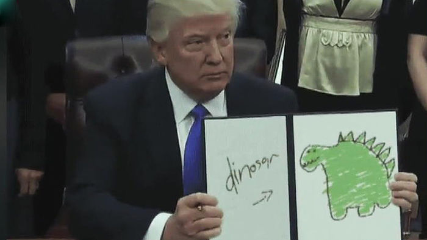
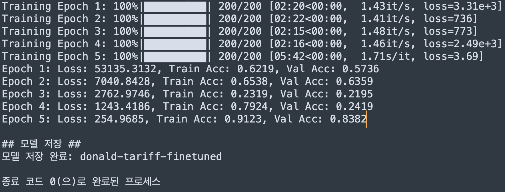
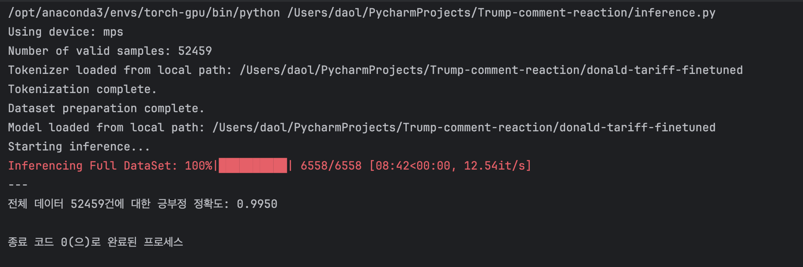
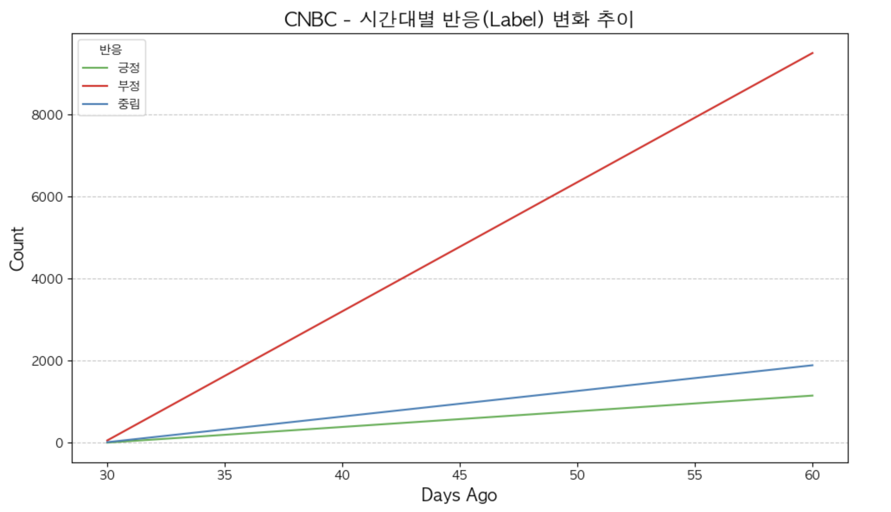
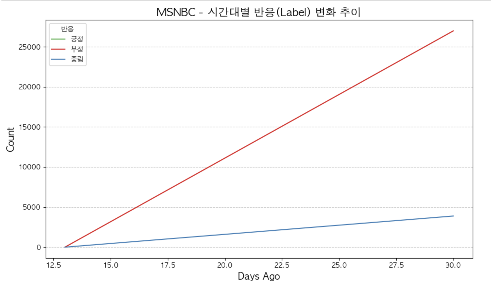
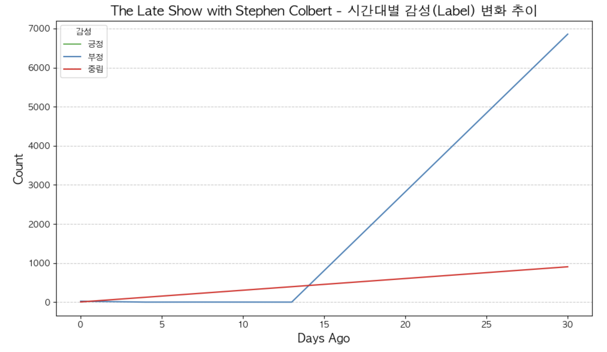

# BERT를 활용한 트럼프의 관세정책에 대한 각 언론사별 사람들의 반응 분석

---


<!--
badge 아이콘 참고 사이트
https://github.com/danmadeira/simple-icon-badges
-->

<p align="left">
  
  
  
  
  
  
</p>
---

# 트럼프 관세 정책과 언론사 성향에 따른 대중 반응 분석

## 1. 이 주제는 왜?

트럼프 미국 대통령은 **2018년부터 본격적으로 고율의 관세를 부과하는 정책**을 시행하며, 미국 중심의 보호무역주의 기조를 강하게 드러냈다. 이러한 관세 정책은 단순한 경제적 조치에 그치지 않고, 미국과 주요 교역국들(중국, 캐나다, 멕시코) 간의 무역 관계를 크게 재편하며, 국제 정치 질서와 글로벌 공급망에 광범위한 영향을 미쳤다. 이는 미국 내에서도 찬반이 극명하게 갈리는 뜨거운 논쟁거리로 부상했으며, 정치·경제·언론계 전반에 걸쳐 다양한 반응을 이끌어냈다.

이 프로젝트는 트럼프의 관세 정책에 대한 대중의 반응에 호기심이 생겨 시작했다. 특히 관심을 가졌던 부분은, 단순히 정책 그 자체만 아니라, 이를 보도하는 언론사의 성향에 따라 대중이 어떤 반응을 보였는지다. 미국 언론은 성향에 따라 같은 사안을 전혀 다른 방식으로 보도하기 때문에, 동일한 이슈에 대한 대중의 반응 역시 매체에 따라 상이할 수 있다. 이에 따라 언론사의 보도 방식과 시청자 반응 간의 관계를 구체적으로 분석해 보고자 했다.

### 1.2 분석 대상 매체 및 성향

| 언론사 | 성향 | 주요 특징 |
|--------|------|------------|
| **CNBC** | 중립 ~ 보수 | CNBC는 미국의 경제 전문 뉴스 채널로, **비즈니스 및 금융 시장 뉴스에 초점을 맞추며**, 실시간 주식 시황, 경제 분석, 기업 전략 등을 보도한다. 특히 정책의 **실효성** 및 **시장 반응**을 중심으로 다루며, 경제 행위자 관점에서 관세 정책을 분석한다. NBCUniversal News Group 산하의 자회사로, 1989년 개국. <br>[출처: Wikipedia - CNBC](https://en.wikipedia.org/wiki/CNBC) |
| **MSNBC** | 진보 | MSNBC는 **자유주의·진보주의 성향의 미국 뉴스 채널**로, 트럼프 정부의 정책에 대해 비판적인 시각을 유지하며, **정치적 책임과 윤리성** 측면을 강조한 보도를 한다. NBCUniversal이 소유하고 있으며, 리버럴한 시청자층을 주로 타겟으로 한다. <br>[출처: Wikipedia - MSNBC](https://en.wikipedia.org/wiki/MSNBC) |
| **The Late Show with Stephen Colbert** | 진보 (풍자 중심) | CBS에서 방영되는 미국 심야 토크쇼로, **풍자와 유머를 통해 정치적 이슈를 비판적으로 다룬다**. 진행자인 Stephen Colbert는 보수주의를 풍자하는 스타일로 유명하며, 특히 트럼프 대통령을 강하게 비판하는 내용을 자주 다룬다. 정치와 문화를 결합한 **대중문화적 해석의 창구** 역할을 한다. <br>[출처: Wikipedia - The Late Show with Stephen Colbert](https://en.wikipedia.org/wiki/The_Late_Show_with_Stephen_Colbert) |

이 세 언론사는 각기 다른 시각—경제, 정치, 대중문화—에서 트럼프의 관세 정책을 다루고 있으며, 이를 통해 하나의 정책이 어떤 식으로 입체적으로 조명될 수 있는지를 잘 보여준다. 동일한 주제를 다루되, 전달 방식, 포맷, 시청자층이 모두 다른 이들 언론사는, 본 프로젝트의 분석 목적에 매우 적합했고, 이는 정치 이슈가 미디어 환경 속에서 어떻게 해석되고, 그 해석이 대중의 인식에 어떤 영향을 미치는가라는 핵심 질문에 대한 통찰을 제공한다.

### 1.3 분석 플랫폼: YouTube

또한, 유튜브라는 플랫폼을 분석 대상으로 선택한 이유도, 유튜브는 단순히 영상을 소비하는 공간이 아니라, **댓글을 통해 대중의 실시간 반응, 감정, 의견을 확인할 수 있는 사회적 여론의 반영 장치**라고 생각했다. 이는 기존 설문조사나 인터뷰 방식보다 훨씬 생생하고 풍부한 데이터를 제공하며, 감성 분석 및 언어 처리 기술을 통해 다양한 인사이트를 이끌어낼 수 있기 때문이다.

### 1.4 분석 목적

결과적으로, 본 프로젝트는 서로 다른 성향의 언론이 동일한 정책을 어떻게 보도하고, 그 보도에 대해 대중이 어떤 정서적 반응을 보였는지를 **BERT 기반 감성 분석**을 통해 구체적으로 살펴봄으로써, 현대 정치가 **언론과 플랫폼, 대중 간 상호작용 속에서 어떻게 형성되는지를 엿보려는 시도**이다.

---


## 2. 영상 선정 기준
유튜브에서 각 언론사 채널에서**트럼프의 관세 정책**을 주제로 한 영상들 중, **조회수와 댓글 수가 많아 대중 반응이 활발한 콘텐츠**를 기준으로 영상을 선정했다.

| 언론사 | 영상 제목 | 조회수   | 댓글 수    |
|--------|---------------------------|-------|---------|
| **CNBC** | How Companies Are Dodging Trump Tariffs On Canada, Mexico And China | 420만회 | 12,644개 | 
| **MSNBC** | Lawrence: Canada's Trudeau humiliates 'cowardly' Trump who backs down on tariffs. Again. | 902만회 | 31,340개 |
| **The Late Show with Stephen Colbert** | Dumbest Trade War In History Effects Of Trump's Tariffs Already Being Felt Chicken Rental Deals | 415만회 | 8,618개  |

본 분석을 통해 다음과 같은 질문에 답하고자 한다:

- 언론사별로 트럼프의 관세 정책에 대한 대중 반응은 어떻게 달랐는가?
- 언론사의 성향이 시청자나 대중들의 반응에 영향이 있는가?
- 보도 방식과 시청자 의견 간에는 어떤 연관성이 있는가?
- 감성 분석 결과를 통해 미국 내 여론 지형과 정치 성향을 예측할 수 있는가?

이 연구는 단순한 여론 조사나 댓글 통계를 넘어서, **딥러닝 기반 자연어 처리 모델(BERT)**을 활용하여 **텍스트의 맥락 속 감정과 입장을 정량적으로 분석**하고, **정치 담론의 확산 구조를 탐색**하는 의의를 두었다.

---
## 3. 데이터 수집 및 전처리

###  3.1 데이터 출처
가장 대중적이고 즉각적인 반응을 확인할 수 있는 유튜브 플랫폼을 활용,. 다음 3개 언론사의 유튜브 영상에서 댓글을 수집했다.

-  CNBC: [https://www.youtube.com/watch?v=h5P8WHBrQvo](https://www.youtube.com/watch?v=h5P8WHBrQvo)  
-  MSNBC: [https://www.youtube.com/watch?v=arHHAfYbM-M](https://www.youtube.com/watch?v=arHHAfYbM-M)  
-  The Late Show with Stephen Colbert: [https://www.youtube.com/watch?v=F90YWg11UAU](https://www.youtube.com/watch?v=F90YWg11UAU)

###  3.2 수집 방법
- Python 기반 크롤링 코드 활용 (Google Colab에서 실행)  
- 참고 블로그: [Naver 블로그 링크](https://m.blog.naver.com/galaxyworldinfo/223615648013)
- 수집된 항목: 댓글 본문, 작성 시점, 해당 언론사 정보
- ### 수집한 유튜브 댓글 예시

| text | time | channel | label |
|------|------|---------|---|
| This is absolutely mind-blowing! | 14 hours ago | CNBC | 1 |
| Companies should start price labelling their products with the (RTT) Republican Trump Tax. e.g. $4.99 + RTT $12.23 | 3 days ago | CNBC | 1 |
| Tariffs are paid by the companies. Consumers pay for products at retail, and if that company increases a price then they may lose that sale to a competitor. If one company wants to gain market-share then they can eat more of the costs while contracting existing US shoe makers to tool up for making their shoes. None of the companies making products like clothing have the monopoly needed for passing the costs completely to the customer. | 8 days ago | CNBC | 2 |


###  3.3 데이터 탐색 (EDA)

- 총 수집된 댓글 수: **54,302건**
- 각 댓글에 대해 언론사 라벨과 작성 날짜 정보 포함
- 영어 댓글만 수집되어 자연어 처리에 적합하다.
---
## 4. 학습 데이터 구축

###  4.1 목표
학습 데이터의 목표는 수집한 유튜브 댓글을
트럼프 전 대통령의 관세 정책에 대한 대중의 입장을
0(긍정), 1(부정), 2(중립)으로 구분하여 정밀하게 라벨링하는 것이다..

원본 데이터에서 54,302개의 댓글 중 2000개 샘플을 추출 후 라벨링하여 BERT 모델 학습을 위한 데이터셋을 구성했다.

### 4.2 데이터 라벨링 과정

본 프로젝트에서는 BERT 기반 분석 모델 학습을 위한 데이터셋을 구축하기 위해, 총 2,000건의 유튜브 댓글을 수작업으로 라벨링했다.

- 세 언론사(CNBC, MSNBC, The Late Show with Stephen Colbert)에서 각각 약 600여 건씩 균형 있게 샘플링하여,
  언론사 간 비교 분석이 가능하도록 구성했다.

- 하루에 약 200개씩, 총 10일간 수작업으로 라벨링을 진행하였으며,
  분석 기준은 다음과 같이 정의하였다:
  
| 라벨 | 의미 | 설명                                                      |
|------|------|---------------------------------------------------------|
| **0 (긍정)** | 지지 | 트럼프의 관세 정책에 대해 **명확히 긍정적이거나 지지하는 입장** 표현  |
| **1 (부정)** | 반대 | 정책에 대해 **비판적**, **조롱**, **반대 의견**을 표현, 혹은 트럼프를 향한 **비난, 조롱** |
| **2 (중립)** | 감정 없음 | **정보 전달**, **유머**, **맥락 없는 언급** 등 **감정적 입장이 드러나지 않는 경우** |

- 영어 댓글이다 보니 번역 과정에서 ChatGPT를 활용하여 번역과 관련한 내용을 받아서 본 후에 스스로의 판단으로 라벨링을 진행했다.

- 라벨링 과정에서 문맥이 모호하거나 풍자, 비유 등이 포함된 댓글에 대해서는
  번역을 받은후 관련 내용과 비교하여 라벨링을 진행.

- 사람의 해석과 AI 언어 모델의 언어 이해 능력을 함께 활용함으로써
  감정 분류 기준의 일관성과 해석의 신뢰도와 라벨링 속도를 높일 수 있었다.

이렇게 정제된 데이터셋은 모델 학습의 성능을 높이는 데 핵심적인 역할을 했으며,
향후 자동 분류 모델의 평가 기준으로도 활용 가능하다.


## 4.4 수집된 데이터 활용
### 전체 라벨 분포도


약 2000개의 데이터를 수집한 후 직접 라벨링하여 전체 라벨 분포를 분석했다.  
분석 결과, **부정(1.0) 라벨이 압도적인 비중**을 차지하고 있음을 확인했다.  
이는 해당 주제(트럼프 관세 관련 보도)에 대한 뉴스 기사 및 댓글에서 **전반적으로 부정적인 반응이 우세**함을 보여줬다.

### 채널별 라벨 분포도


채널별로 라벨 분포를 살펴본 결과, **모든 채널에서 부정(1.0) 라벨이 가장 높은 비중**을 차지하였다.  
물론 채널별 시청자층의 성향과 정치적 견해 차이를 감안해야 하지만, 이를 고려하더라도 **전반적인 부정적 반응이 뚜렷하게 나타남**을 알 수 있다.

특히 `The Late Show with Stephen Colbert` 와 같은 풍자적 성향의 채널에서는 **긍정(0.0) 및 중립(2.0)에 비해 부정적 반응이 더욱 두드러지게 나타나는 경향**을 확인할 수 있었다.  
이러한 결과는 **뉴스 매체별 보도 톤의 차이**와 함께 **대중 여론의 전반적 경향성**도 반영하고 있다고 해석할 수 있다.

## 5. MobileBERT Finetuning(재학습, 미세조정) 결과
<p align="left">
  
</p>

### 5.1 학습 결과

| epoch | 1 | 2 | 3 | 4 | 5 |
|--------|----|----|----|----|----|
| training loss | 53135.31 | 7040.84 | 2762.97 | 1243.42 | 254.97 |
| Train Accuracy | 0.6219 | 0.6538 | 0.2319 | 0.7924 | 0.9123 |
| Validation Accuracy | 0.5736 | 0.6359 | 0.2195 | 0.2419 | **0.8382** |


### 5.2 epoch별 손실값과 정확도

초기 Training Loss가 매우 높게 시작되었지만, 에포크가 진행됨에 따라 빠르게 손실값이 줄고 정확도는 꾸준히 상승했습니다. 특히 마지막 에포크에서 Validation Accuracy가 0.8382로 최고치를 기록하며, 안정적인 학습이 이루어졌습니다.

학습 중간에 정확도가 일시적으로 낮아지는 구간이 있었으나, 전체적으로 보았을 때 안정적인 학습 경향을 보이며 과적합 없이 성능이 개선되었습니다.


### 5.3 학습 모델에 대한 전체적인 평가

해당 모델은 학습 초반 손실값이 매우 높았음에도 불구하고, 이후 빠르게 수렴하며 높은 Training Accuracy(0.9123)와 Validation Accuracy(0.8382)를 기록했습니다.

전체 학습 흐름과 결과를 종합적으로 고려했을 때, **모델은 안정적인 수렴을 보여주며 실제 응용 환경에서도 활용 가능성이 높습니다.**

### 5.4 학습된 모델을 원본 데이터에 적용한 결과

모델 추론(inference)은 총 **52,459건의 원본 데이터**에 대해 수행되었으며, 아래와 같은 절차로 진행되었습니다.

- 위에서 학습된 모델을 활용해 **라벨이 없는 원본 데이터에 긍/부정 라벨링을 자동 수행**
- 토크나이저 로드 및 데이터 전처리 완료
- 학습된 모델(`donald-tariff-finetuned`) 로드
- 전체 데이터셋에 대한 추론 수행 (6558배치, 약 8분 소요)
- 최종 **공부정(긍/부정) 분류 정확도: 0.9950**
<p align="left">
  
</p>
이 결과는 학습된 모델이 단순히 학습 데이터에만 최적화된 것이 아니라, 실제 환경의 원본 데이터에도 **우수한 일반화 성능을 발휘**하고 있다는 점을 시사합니다.  
특히 라벨이 없는 데이터를 자동으로 분류해 라벨링할 수 있다는 점에서, 해당 모델은 **추가적인 데이터셋 구축이나 후속 작업에 직접 활용**될 수 있는 높은 실용성을 가지고 있다고 생각됩니다.


```txt
전체 데이터 52459건에 대한 긍부정 정확도: 0.9950
```

또한 약 12.5it/s 속도로 빠르게 추론을 마쳤으며, 실시간 처리에도 충분히 적합한 속도와 정확도를 갖추고 있습니다.  
이러한 성능은 모델이 실제 서비스에 적용될 수 있는 수준이라는 것을 의미하며, 향후 확장에도 강한 기반이 됩니다.


## 6. 본 프로젝트를 통해 얻은 결과

<p align="left">
  
</p>

<p align="left">
  
</p>

<p align="left">
    
</p>

시간대별 반응 추이를 비교해 보았을때 시간이 지나도 여전히 부정적인 여론이 강한것을 알수 있습니다.

## 7. 결론 및 느낀점